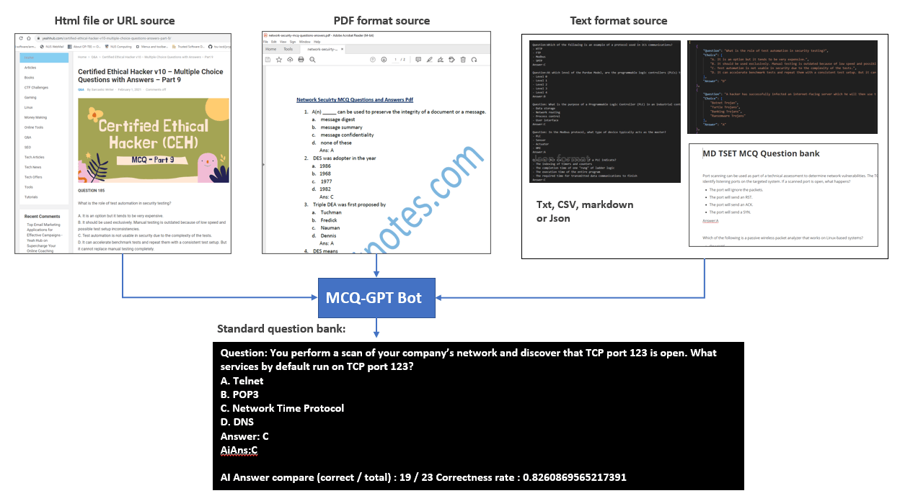

# MCQ-GPT-Bot

**Program design**:  We want to create an assistant AI-Bot program which can batch process the multi choice cyber security exam questions (From different source format: `url`, `html`, `txt`, `pdf`) via OpenAI to get the answer so the researcher can use it to check the AI's answer correctness rate.

[TOC]

------

### Introduction

The MCQ-GPT-Bot will is an automate AI-Bot assistant AI-Bot program which provides below functions: 

- Parse multi-choice-questions from different format data source to build the standard question bank files for further process such as training.
- If the question sources don't content the answer, use OpenAI to get the answer. 
- If the question sources also provide the answer, compare with AI's answer and calculate the AI's correctness rate.

The program will use the [LangChain](https://python.langchain.com/docs/get_started/introduction.html) frame work to implement the communication with the OpenAI.

##### Program Workflow Diagram

The program will follow below workflow to load the question sources, process the questions and archive the result:


`Version: v0.1.2` 


------

### Program Design 

The program contents 3 main module: 

**QuestionParser** : Load the function data from files or URL, then use AI to parse the MCQs and generate the standard question bank data.

**McqDataManager **: Data manager to store and questions, AI's answers and format the questions. 

**llmMcqSolver** : load the question from the data manager, call OpenAI API to get the answer and calculate the AI's correctness rate based on the setting.

After process, different kind of question format source will be convert to the standard question bank file format as shown blow: 



The question bank file will follow below format: 

```
Question:< Question string >
A. choice 1
B. choice 2
C. choice 3
D. choice 4
Answer:<correct answer>
AiAns:<Answer gave by OpenAI>

Question:< Question string >
...
AI Answer compare (correct / total) : <correct number> / <total number>
Correctness rate: <>
```


lib need to install:

```
pip install unstructured
pip install pdf2image
pip install pdfminer
pip install pdfminer-six
```


------

> last edit by LiuYuancheng (liu_yuan_cheng@hotmail.com) by 15/08/2023 if you have any problem, please send me a message. 