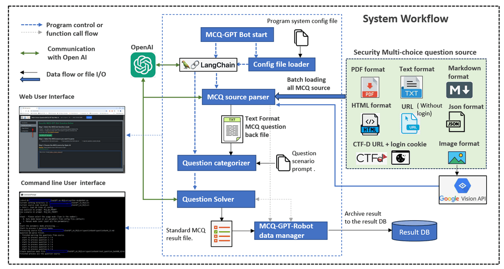

# MCQ-GPT-Bot

**Program design**:  We want to create an assistant AI-Bot program which can batch process the multi choice cyber security exam questions (From different source format: `url`, `html`, `txt`, `pdf`) via OpenAI to get the answer so the researcher can use it to check the AI's answer correctness rate.

[TOC]

------

### Introduction

The MCQ-GPT-Bot will is an automate AI-Bot assistant AI-Bot program which provides below functions: 

- Parse multi-choice-questions from different format data source to build the standard question bank files for further process such as training.
- If the question sources don't content the answer, use OpenAI to get the answer. 
- If the question sources also provide the answer, compare with AI's answer and calculate the AI's correctness rate.

The program will use the [LangChain](https://python.langchain.com/docs/get_started/introduction.html) frame work to implement the communication with the OpenAI.

##### Program Workflow Diagram

The program will follow below workflow to load the question sources, process the questions and archive the result:



The program is a single thread program to continuous loading all the question source file/url set in the config file, convert to the standard's question format, then based on the question type setup the LLM's scenario prompt and send to the questions solver to get the AI's solution. If you have multiple OpenAI-API, you can also config multi-thread with several parser and question solver to increase the processing efficiency.

##### AI Solution Correctness 

Based on our test to applying on 500+ MCQ question, currently for different lvl difficulty cyber security question (such as CISCO-CCIE, Huawei Certified Network Associate exam, IBM Security QRadar certificate exam) , the AI can provide **60% to 80%** correctness rate. 


`Version: v0.1.2` 


------

### Program Design 

As shown in the workflow diagram, the program contents three main modules: 

**QuestionParser** : Load the function data from files or URL, then use AI to parse the MCQs and generate the standard question bank data.

**McqDataManager **: Data manager to store and questions, AI's answers and format the questions. 

**llmMcqSolver** : load the question from the data manager, call OpenAI API to get the answer and calculate the AI's correctness rate based on the setting.

After process, different kind of question format source will be convert to the standard question bank file format as shown blow: 


The question bank file will be built as a text file which follow below format: 

```
Question:< Question string >
A. choice 1
B. choice 2
C. choice 3
D. choice 4
Answer:<correct answer>
AiAns:<Answer gave by OpenAI>

Question:< Question string >
...
AI Answer compare (correct / total) : <correct number> / <total number>
Correctness rate: <>
```


##### Program module files list

| Idx  | Program File                       | Execution Env | Description                                                  |
| ---- | ---------------------------------- | ------------- | ------------------------------------------------------------ |
| 1    | src/config.txt                     |               | System config file.                                          |
| 2    | src/mcqGptBot.py                   | python 3      | Main MCQ process program                                     |
| 3    | src/mcqGptBotUtils.py              | python 3      | Provide different OpenAI utility function modules used by the MCQ-GPT-Bot modules. |
| 4    | src/mcqGptBotGlobal.py             | python 3      | System global file, the system config file's contents will be saved in the global parameters. |
| 5    | lib/ConfigLoader.py                | python 3      | Configuration file loading module.                           |
| 6    | lib/Log.py                         | python 3      | Log module.                                                  |
| 7    | questionbank/*                     |               | All the question source files.                               |
| 8    | questionbank/questionContents.json |               | Question source config json file.                            |


------

### Program Setup

###### Development Environment : python 3.8.2 rc2

###### Additional Lib/Software Need

1. **OpenAI** : https://github.com/openai/openai-python
2. **langChain** :  https://python.langchain.com/docs/get_started/installation
3. **Pylib need to install**:

```
pip install unstructured
pip install pdf2image
pip install pdfminer
pip install pdfminer-six
pip install --upgrade openai
pip install langchain
```

4. **Valid Open AI API key** : https://help.openai.com/en/articles/4936850-where-do-i-find-my-secret-api-key

###### Hardware Needed : None


------

### Program Usage

Please follow below steps to process the MCQ source files:

##### Step1: Copy the MCQ source file 

Copy the MCQ files ( `*.html`, `*.txt`, `*.md`, `*.pdf` )  you want to process and `questionContents.json` to the a folder in the `src` folder (such as the `questionbank` ).  Add the files you want to process in the `questionContents.json` as below : 

```
"name": "test_question_bank03",
"type": "url",
"src": "https://www.yeahhub.com/certified-ethical-hacker-v10-multiple-choice-questions-answers-part-9/"
```

- name : The question bank file name. 
- type: Mcq source type (html, url, md, pdf, txt).
- src: file name or URL


##### Step2: Set the configuration file

Rename the configuration file template `config_template.txt` to `config.txt` and add you OpenAI-API key as below:

```
# This is the config file template for the module <mcqGptBot.py>
# Setup the parameter with below format (every line follow <key>:<val> format, the
# key cannot be changed):

# set openAI API key
API_KEY:

# select the AI model apply to the mcq.
AI_MODEL:gpt-3.5-turbo-16k

# folder name of the question source files, the source folder need to be in the 
# same folder of mcqGptBot.py.
QS_BANK_DIR:questionbank

# The json file which contents the source files information need to process in the 
# question source folder.
QS_CONT_JSON:questionContents.json
```


##### Step3: Run the Bot to batch process all the MCQ source

Run program:

```
python mcqGptBot.py
```

The finished processed question will be saved in the text question bank file which same name as the name you set in the `questionContents.json` file. You can refer to the questionbacnk folder to check the detail. Example: 

`network-secuirty-quiz-questions-answers.pdf` => `test_question_bank03.txt`


------

### Problem and solution

##### Problem [0]: Execution Exception: OpenAI API timeout

If you are using Free OpenAI-API key, one minutes you can only process 3 questions, so you may met timeout problem as shown below: 

```
(vEnv3.8) C:\Works\NCL\Project\ChatGPT_on_MCQ\src>python mcqGptBot.py
Current working directory is : C:\Works\NCL\Project\ChatGPT_on_MCQ\src
Current source code location : C:\Works\NCL\Project\ChatGPT_on_MCQ\src
> Init(): load 4 lines of config
Start to process 4 question banks
Processing source file: C:\Works\NCL\Project\ChatGPT_on_MCQ\src\questionbank\questionbank_19.txt
Question parse finish.
- finished parsing the questions from source.
Create question bank file: C:\Works\NCL\Project\ChatGPT_on_MCQ\src\questionbank\test_question_bank01.txt
Processing source file: C:\Works\NCL\Project\ChatGPT_on_MCQ\src\questionbank\questionbank_20.html
Question parse finish.
- finished parsing the questions from source.
Create question bank file: C:\Works\NCL\Project\ChatGPT_on_MCQ\src\questionbank\test_question_bank02.txt
Processing MCQ url: https://www.yeahhub.com/certified-ethical-hacker-v10-multiple-choice-questions-answers-part-9/
Question parse finish.
- finished parsing the questions from source.
Create question bank file: C:\Works\NCL\Project\ChatGPT_on_MCQ\src\questionbank\test_question_bank03.txt
Processing prf source file: C:\Works\NCL\Project\ChatGPT_on_MCQ\src\questionbank\network-secuirty-quiz-questions-answers.pdf
Question parse finish.
```

This is normal, you need to set the payment on you openAI account. 


------

> last edit by LiuYuancheng (liu_yuan_cheng@hotmail.com) by 15/08/2023 if you have any problem, please send me a message. 