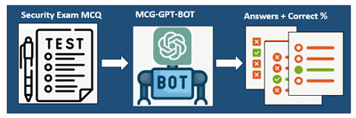
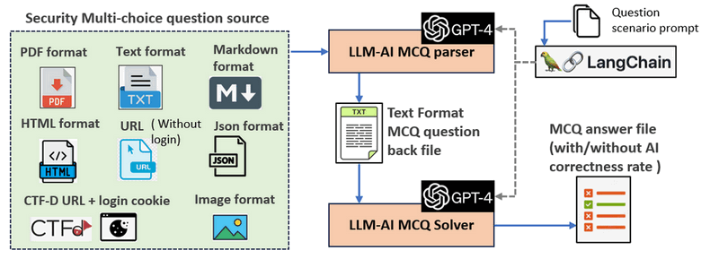

# MCQ-GPT-ROBOT

### Large Language Module Cyber Security Multi-Choice-Questions Solver

 

**Program Design Purpose**: Our objective is to develop a simple LLM-AI assistant program capable of efficiently automated processing batches of multi-choice cyber security questions sourced from various formats such as Markdown (md) , URL, HTML, Text (`txt`), Json and PDF. Leveraging Open-AI (ChatGPT), the program will provide answers to these questions, enabling researchers to assess the AI's accuracy in answering queries (such as the prompt engineering), its performance across diverse fields, and conduct comprehensive data analysis. The program workflow overview is shown below:



```
# Created:     2023/08/23
# version:     v0.1.4
# Copyright:   Copyright (c) 2023 LiuYuancheng
# License:     MIT License
```

**Table of Contents**

[TOC]

- [MCQ-GPT-ROBOT](#mcq-gpt-robot)
    + [Large Language Module Cyber Security Multi-Choice-Questions Solver](#large-language-module-cyber-security-multi-choice-questions-solver)
    + [Introduction](#introduction)
        * [Introduction of Program Workflow](#introduction-of-program-workflow)
        * [AI Solution Correctness](#ai-solution-correctness)
    + [Program Design](#program-design)
        * [Design of 'QuestionParser' Module](#design-of--questionparser--module)
        * [Design of 'McqDataManager' Module](#design-of--mcqdatamanager--module)
        * [Design of 'llmMcqSolver' Module](#design-of--llmmcqsolver--module)
        * [Question Solution Prompt](#question-solution-prompt)
    + [Program Setup](#program-setup)
          + [Development Environment : python 3.8.2 rc2](#development-environment---python-382-rc2)
          + [Additional Lib/Software Need](#additional-lib-software-need)
          + [Hardware Needed : None](#hardware-needed---none)
        * [Program module files list](#program-module-files-list)
    + [Program Usage](#program-usage)
    + [Problem and Solution](#problem-and-solution)
    + [Reference](#reference)
        * [AI Answer's Correctness rate for cyber security MCQ question test:](#ai-answer-s-correctness-rate-for-cyber-security-mcq-question-test-)

------

### Introduction

The MCQ-GPT-ROBOT is an automated AI assistant program to help the cyber security researchers to process batches of multi-choice cyber security questions by using LLM AI module. The program will try to convert different format of the questions source to standard question back format text file then get the answers. With different question prompt scenario setting, it can also applied to solve MCQ questions under other field. The program is designed to streamline three key functions:

- It parses multi-choice questions from various data sources, enabling the creation of standardized question bank files for further processing, such as training through data normalization.
- In cases where the question sources lack answers, the program leverages Open-AI to obtain the answers, either with or without scenario prompts.
- Additionally, if the question sources do provide answers, the program compares them with the AI-generated answers and calculates the AI's correctness rate.

To facilitate seamless communication with the Open-AI API, the program utilizes the [LangChain](https://python.langchain.com/docs/get_started/introduction.html) framework. Furthermore, we provide both console interface and the web interface allow researchers to test their prompts and integrate the bot/function in their program.

##### Introduction of Program Workflow 

The program employs a dual-threaded approach, with one thread dedicated to parsing MCQ source files and the other to solving MCQs, enabling parallel processing of security questions. The system workflow is depicted below:


`Diagram Version: v0.1.3` 

The MCQ source parser module continuously loads all question source files/URLs specified in the configuration file, which can be selected from the command console interface or uploaded via the web interface. It converts these questions into a standardized format, adjusts the LLM's scenario prompts based on the question type, and then sends them to the question solver module to obtain the AI's solution. If the users have multiple OpenAI-API, they can also config multi-thread with several parser and question solver to increase the processing efficiency.

##### AI Solution Correctness 

Based on our test to applying on 500+ MCQ question, currently for different level difficulty cyber security question (such as CISCO-CCIE, Huawei Certified Network Associate exam, IBM Security QRadar certificate exam ...) , the AI can provide **60% to 80%** correctness rate. For the correctness test, please refer to the reference section: [AI Answer's Correctness rate for cyber security MCQ question test](#ai-answer-s-correctness-rate-for-cyber-security-mcq-question-test-)


------

### Program Design 

As illustrated in the workflow diagram in the introduction section, the processing of MCQ data follows the data flow outlined below:


The program will provide three main modules to finish the steps: 

##### Design of 'QuestionParser' Module

The MCQ question data parser module ( `QuestionParser` ) conducts data mining and normalization. It extracts content from MCQ source files or URLs, utilizes AI to identify all MCQs, and generates standardized question bank data. Each question is formatted as follows:

```
Question:< Question string >
A. choice 1
B. choice 2
C. choice 3
D. choice 4
```

##### Design of 'McqDataManager' Module

The MCQ data manager ( `McqDataManager` ) handles data storage and result archiving. It stores questions, AI-generated answers, and formats the results. Since multiple question sources are batch processed, the data manager logs progress (e.g., whether a source file's result has been archived). This ensures that if program execution is interrupted, users can resume without reprocessing the entire source. 

##### Design of 'llmMcqSolver' Module 

The Large Language Model MCQ solver ( `LLM-MCQSolver` ) retrieves questions from the data manager, preloads MCQ scenario prompts to OpenAI, and calls the OpenAI API to obtain answers. It calculates the AI's correctness rate based on the settings. After processing, different formats of question sources are converted to the standardized question bank file format as depicted below:


The question bank file (data archiving) will be built as a text file which follow below format: 

```
Question:< Question string >
A. choice 1
B. choice 2
C. choice 3
D. choice 4
Answer:<correct answer>
AiAns:<Answer gave by OpenAI>

Question:< Question string >
...
AI Answer compare (correct / total) : <correct number> / <total number>
Correctness rate: <>
```


##### Question Solution Prompt

Based on our test, the AI will provide a higher problem solving correctness rate if we load a problem solving scenario prompt to the AI before we pass the real MCQ question to llmMcqSolver. For example if we want to process the Cisco CCNP Security Implementing Cisco Threat Control Solutions Exam, when we pre-load the below CCPN prompt to the AI before pass the question to AI: 

```
CCNA_SOL_TEMPLATE = """You are a helpful assistant who find the answer of the Cisco CCNP Security Implementing Cisco Secure Access multi choice questions. Just give the correct choice's front indicator character or characters (if the question shows you need to choose more than one choice). Return choice indicator character in a in a comma separated list. 
"""
```

The correctness rate will increate from (60/144) **41.66%** (If we don't set scenario prompt) to (73/144) **50.06%** if we test 144 questions. If you load a good scenario prompt to the AI, AI will understand the question better especially for the worlds abbreviations appear in the question.


------

### Program Setup

###### Development Environment : python 3.8.2 rc2

###### Additional Lib/Software Need

1. **OpenAI** : https://github.com/openai/openai-python
2. **langChain** :  https://python.langchain.com/docs/get_started/installation
3. **Pylib need to install**:

```
pip install unstructured
pip install pdf2image
pip install pdfminer
pip install pdfminer-six
pip install markdown
pip install --upgrade openai
pip install langchain
```

4. **Valid OpenAI-API key** : https://help.openai.com/en/articles/4936850-where-do-i-find-my-secret-api-key

###### Hardware Needed : None

##### Program module files list

| Idx  | Program File                       | Execution Env | Description                                                  |
| ---- | ---------------------------------- | ------------- | ------------------------------------------------------------ |
| 1    | src/config_template.txt            | txt           | System config file template.                                 |
| 2    | src/mcqGptBot.py                   | python 3      | Main MCQ auto batch process program command interface program. |
| 3    | src/mcqGptBotUtils.py              | python 3      | Provide different OpenAI utility function modules used by the MCQ-GPT-Bot and the MCQ-GPT-App modules. |
| 4    | src/mcqGptBotGlobal.py             | python 3      | System global file, the system config file's contents will be saved in the global parameters. |
| 5    | src/mcqGptPromptRepo.py            | python 3      | Repo to save the customized AI prompt.                       |
| 6    | lib/ConfigLoader.py                | python 3      | Configuration file loading module.                           |
| 7    | lib/Log.py                         | python 3      | Log module.                                                  |
| 8    | questionbank/*                     |               | All the question source files.                               |
| 9    | questionbank/questionContents.json | json          | Question source config json file.                            |


------

### Program Usage

Please refer to the usage manual document: [link](UsageManual.md)

Run the program under command console mode: 

```
python/python3 mcqGptBot.py
```

Run the program by using the web interface 

```
python/python3 mcqGptApp.py
```

Then open the url https://127.0.0.1:5000 to check the web 


------

### Problem and Solution

For program usage problem and the related solution, please refer to the [Link of Issue File](ProblemAndSolution.md)


------

### Reference

##### AI Answer's Correctness rate for cyber security MCQ question test: 

| idx  | Question bank                                                | Question bank file     | correct  Answer  num | total Question num | correct rate                 |
| ---- | ------------------------------------------------------------ | ---------------------- | -------------------- | ------------------ | ---------------------------- |
| 1    | CTF cyber-security question example (javatpoint exam)        | questionbank_00.txt    | 39                   | 60                 | 65.0%                        |
| 2    | ISA Cybersecurity Specialist Exam (ICS/IEC 62443)            | questionbank_01.txt    | 30                   | 38                 | 78.94%                       |
| 3    | CCIE Advanced Security Written Exam 2023                     | questionbank_02.txt    | 46                   | 63                 | 73.01%                       |
| 4    | Microsoft Cybersecurity Architect SC100                      | questionbank_03.txt    | 33                   | 43                 | 76.74 %                      |
| 5    | 首届360杯网络安全职业技能CTF大赛初赛                         | 360CTF理论大赛试题.pdf |                      |                    | Applying for answer          |
| 6    | 华东师范 XCTF 集训营 2020                                    | questionbank_07.txt    |                      |                    | need to translate to English |
| 7    | Yeahhub CTF-repo: Certified Ethical Hacker 2021 v10 exam part (1-2) | questionbank_08.txt    | 38                   | 46                 | 82.60 %                      |
| 8    | Yeahhub CTF-repo: Certified Ethical Hacker 2021 v10 exam part (3-4) | questionbank_09.txt    | 38                   | 53                 | 71.69%                       |
| 9    | Yeahhub CTF-repo: Certified Ethical Hacker 2021 v10 exam part (5-6) | questionbank_10.txt    | 31                   | 62                 | 50.0%                        |
| 10   | Yeahhub CTF-repo: Certified Ethical Hacker 2021 v10 exam part (7-8) | questionbank_11.txt    | 38                   | 45                 | 84.44%                       |
| 11   | Yeahhub CTF-repo: Certified Ethical Hacker 2021 v10 exam part (9-10) | questionbank_12.txt    | 35                   | 45                 | 77.77%                       |
| 12   | Yeahhub CTF-repo: Certified Ethical Hacker 2021 v10 exam part (11-12) | questionbank_13.txt    | 36                   | 46                 | 78.26%                       |
| 13   | Yeahhub CTF-repo: Certified Ethical Hacker 2021 v10 exam part (13-14) | questionbank_14.txt    | 32                   | 44                 | 72.72 %                      |
| 14   | CCNA Security Implementing Cisco Network Security Exam       | questionbank_15.txt    | 34                   | 55                 | 61.81%                       |
| 15   | CCNP Security Implementing Cisco Edge Network Security Solutions (SENSS) Exam | questionbank_16.txt    | 32                   | 58                 | 55.17%                       |
| 16   | CCNP Security Implementing Cisco Secure Access Solutions (SISAS) Exam | questionbank_17.txt    | 12                   | 24                 | 50.0%                        |
| 17   | CCNP Security Implementing Cisco Threat Control Solutions Exam | questionbank_18.txt    | 23                   | 38                 | 60.52 %                      |
|      |                                                              |                        |                      |                    |                              |


------

> last edit by LiuYuancheng (liu_yuan_cheng@hotmail.com) by 15/08/2023 if you have any problem, please send me a message. 