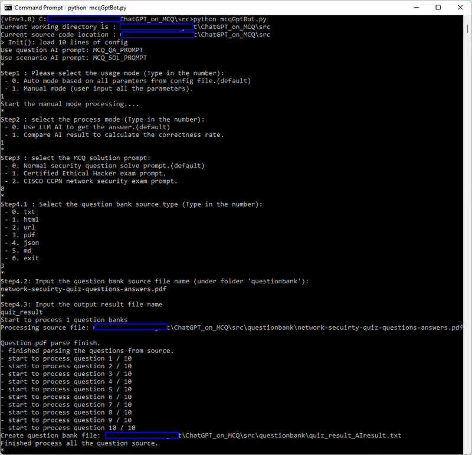
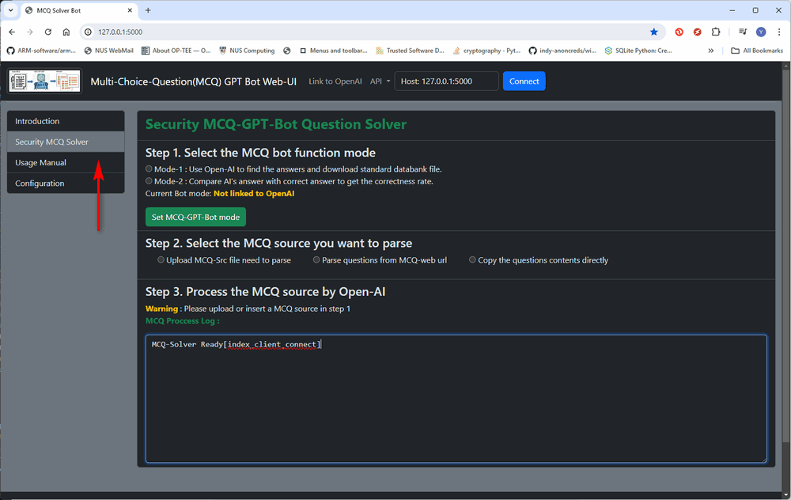
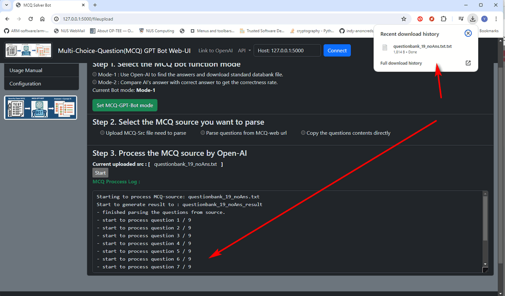

# MCQ-GPT-ROBOT Usage Manual

This document will introduce how to use the Cyber Security AI robot by console interface or the web interface and how to use the API to integrate the bot/function in your program.

**Table of Contents**

[TOC]

- [MCQ-GPT-ROBOT Usage Manual](#mcq-gpt-robot-usage-manual)
    + [Use MCQ-GPT-ROBOT Console Interface](#use-mcq-gpt-robot-console-interface)
      - [Step1: Copy the cyber security MCQ source files](#step1--copy-the-cyber-security-mcq-source-files)
      - [Step2: Set the MCQ-GPT-ROBOT execution configuration file](#step2--set-the-mcq-gpt-robot-execution-configuration-file)
      - [Step 3: Run the MCQ-GPT-ROBOT to batch process all the MCQ sources](#step-3--run-the-mcq-gpt-robot-to-batch-process-all-the-mcq-sources)
      - [Step 4: Check the MCQ solving result or the AI correctness rate](#step-4--check-the-mcq-solving-result-or-the-ai-correctness-rate)
    + [Use MCQ-GPT-ROBOT Web Interface](#use-mcq-gpt-robot-web-interface)
      - [Step 1: Set the MCQ-GPT-ROBOT execution configuration file](#step-1--set-the-mcq-gpt-robot-execution-configuration-file)
      - [Step 2: Run the MCQ-GPT-ROBOT web host program](#step-2--run-the-mcq-gpt-robot-web-host-program)
        * [Step 2.1 Set the robot function mode](#step-21-set-the-robot-function-mode)
        * [Step 2.2 Upload the question source](#step-22-upload-the-question-source)
        * [Step2.3 process the MCQ source](#step23-process-the-mcq-source)

------

### Use MCQ-GPT-ROBOT Console Interface

Follow the below steps to use the MCQ-GPT-ROBOT via command interface. The user can use the config file to automated processing batches of multi-choice cyber security question files or use the manual mode to input the parameters.


#### Step1: Copy the cyber security MCQ source files 

Copy the MCQ files ( `*.html`, `*.txt`, `*.md`, `*.json` , `*.pdf` )  you want to process and `questionContents.json` to the a folder in the `src` folder (such as the `questionbank` folder ).  Add or append the files you want to process in the `questionContents.json` as below : 

```
"name": "test_question_bank03",
"type": "url",
"src": "https://www.yeahhub.com/certified-ethical-hacker-v10-multiple-choice-questions-answers-part-9/"
```

The 3 input parameters detail is shown below:

- **name** : The MCQ question bank file name you want to archive (The result saving file's name).
- **type**: Mcq source file type ( current support type: `html`, `url`, `json`, `md`, `pdf`, `txt`).
- **src**: The source file name or URL  process under the folder.

You can add multiple MCQ src in the list of the json config file.


#### Step2: Set the MCQ-GPT-ROBOT execution configuration file

Rename the configuration file template `config_template.txt` to `config.txt` and add you OpenAI-API key as below:

```
# This is the config file template for the module <mcqGptBot.py>
# Setup the parameter with below format (every line follow <key>:<val> format, the
# key cannot be changed):

# set openAI API key
API_KEY: <Yout own OpenAI API key>

# select the AI model apply to the mcq.
AI_MODEL:gpt-3.5-turbo-16k

# folder name of the question source files, the source folder need to be in the 
# same folder of mcqGptBot.py.
QS_BANK_DIR:questionbank

# The json file which contents the source files information need to process in the 
# question source folder.
QS_CONT_JSON:questionContents.json

# Define the MCQ question AI prompt constant name in <mcqGptPromptRepo.py> will be used, 
# if not defined, will use the default one 'MCQ_TEMPLATE' in the <mcqGPTBotGlobal.py>
MCQ_PROMPT:MCQ_QA_PROMPT

# Define the MCQ solving scenario AI prompt constant name in <mcqGptPromptRepo.py> will 
# be used, if not defined, will use the default one 'SCE_TEMPLATE' in the <mcqGPTBotGlobal.py>
SCE_PROMPT:CCNP_SOL_PROMPT
```


For the prompt config, please refer to the config prompt file `mcqGptPromptRepo.py` this is and example to setup a simple Certified Ethical Hacker exam prompt, in the prompt give AI some background knowledge about the exam and the material for AI to refer to. 

```
# Certified Ethical Hacker exam prompt here
CEH_SOL_PROMPT = """You are a helpful assistant who find the answer of the certified Ethical Hacker multi choice questions exam. 

Certified Ethical Hacker provides comprehensive training, handson learning labs, practice cyber ranges for engagement, certification assessments, cybercompetitions, and opportunities for continuous learning into one comprehensive program curated through our new learning framework: 1. Learn 2. Certify 3. Engage 4. Compete.

Please refer to the Certified Ethical Hacker latest(12th version STUDY GUIDE) training material http://eprints.binadarma.ac.id/1000/1/KEAMANAN%20SISTEM%20INFORMASI%20MATERI%201.pdf as the highest priority  guide to solve the questions, if there is any conflict between the command knowledge and the guiding material. 

Just give the correct choice's front indicator 
character or characters (if the question shows you need to choose more than one choice). 
Return choice indicator character in a in a comma separated list. 
"""
```


#### Step 3: Run the MCQ-GPT-ROBOT to batch process all the MCQ sources

Run program:

```
python mcqGptBot.py
```

**Auto process mode:**

- Select the auto mode based on all parameters from config file by input 0 as shown below in the execution step1

An example to auto process a markdown MCQ file is shown below:


**Manual Process mode:** 

- Step1: Select the auto mode based on all parameters from config file by input 1 as shown below in the execution step1. 
- Step2: Select the process mode (get the answer or calculate the correctness rate)
- Step3: Select the MCQ solution prompt. 
- Step4.1: Select the question bank source type. 
- Step4.2: Input the question bank source file name
- Step4.3: Input the output result file name

An example to manual process a pdf MCQ file is shown below:




#### Step 4: Check the MCQ solving result or the AI correctness rate

The processed question will be saved in the text question bank file which same name as the name you set in the `questionContents.json` file. You can refer to the `questionbank` folder to check the detail. Example: 

`network-secuirty-quiz-questions-answers.pdf` => `test_question_bank03.txt`

All the result will follow below format:

```
...
Question: What is the code written for?
A. Buffer Overflow
B. Encryption
C. Denial-of-service (DoS)
D. Bruteforce
Answer: A
AiAns:B
...
AI Answer compare (correct / total) : 4 / 6 Correctness rate : 0.67
```


------

### Use MCQ-GPT-ROBOT Web Interface

Follow the below steps to use the MCQ-GPT-ROBOT via web interface. 

#### Step 1: Set the MCQ-GPT-ROBOT execution configuration file

Set the configure file OpenAI key and module (same setting as the previous sectiohn`Use MCQ-GPT-ROBOT Console Interface setp2` ), change the flask app parameters as shown below (Set the test mode flag `TEST_MD` to false, if set to true the web will not link to your OpenAI  API)

```
#-----------------------------------------------------------------------------
# Init the Flask app parameters
TEST_MD:False
FLASK_SER_PORT:5000
FLASK_DEBUG_MD:False
FLASK_MULTI_TH:True
```


#### Step 2: Run the MCQ-GPT-ROBOT web host program

Run program:

```
python mcqGptApp.py
```

Based on the config file port, open browser and type in web interface URL : http://127.0.0.1:5000 , select the **Security MCQ Solver** from the left guide navigation bar. (As shown below)



> Remark: if the log shows MCQ-Solver ready which means the program is connect to Open-AI server correctly. 

##### Step 2.1 Set the robot function mode 

Select the mode and press the button "Set MCQ-GPT-Bot mode " button as shown below:


##### Step 2.2 Upload the question source 

Upload the source with different source type : 


##### Step2.3 process the MCQ source 

Press the "Start" button to press the MCQ source, when the source process finished, the result will be automated download. 




------

> last edit by LiuYuancheng (liu_yuan_cheng@hotmail.com) by 29/04/2023 if you have any problem, please send me a message. 